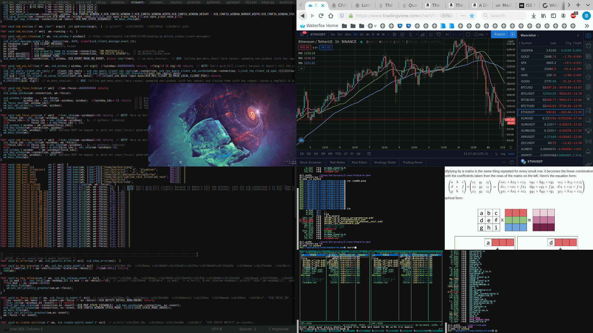
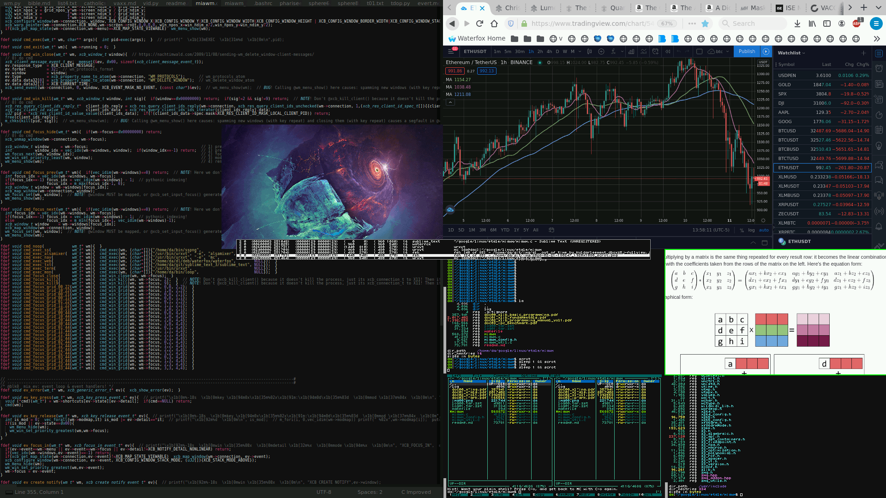
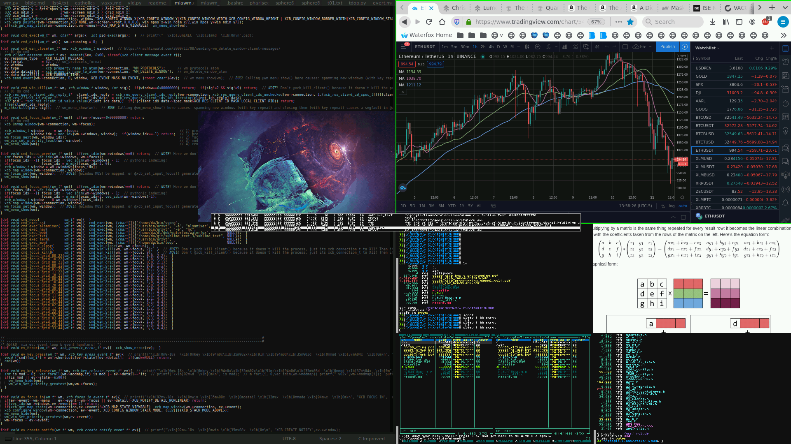

--------------------------------------------------------------------------------------------------------------------------------
# miawm


`miawm` (mathIsART window manager) is a **minimalistic**, **keyboard-only** window manager for the **X Window System** (aka. **X11**).  

`miawm` subscribes to the Unix philosophy (do one thing, and do it well), and considers that a window manager must do **exactly 2 things**:  

  0) manage windows (move, resize, hide)  
  1) implement universal shortcuts (mostly for launching/closing applications, and changing the **window focus**)  

In particular, a window manager must **not**:  

  0) reparent top-level windows (or any window)  
  1) draw window frames  
  2) draw window decorations/buttons/titlebars/menus  
  3) draw application menus (an exception is the menu that has the list of all the windows)  
  4) have anything to do whatsoever with drawing UI elements  
  5) have anything to do whatsoever with **compositing** (ie. the so-called "compositing" window managers are an oxymoron; a "compositing window manager" is not a window manager, but a *chimeric abomination*)  
  6) dishonor application position/size requests sent via `@xcb_create_window()`

A good window manager is an invisible window manager.  
A window manager must get out of the way as much as possible.  

The result of this is that window manager are naturally very simple applications, and require very little code.  
The logic for a window manager is very linear and the responsibilities few, and so its code must be very linear (and small) as well.  






# dependencies

```
libxcb
libxcb-res
```

# notes

`xcb` has almost no formal documentation.  
So, its best "documentation" is the source code itself.  
However, most of the source code is machine-generated from a description of the `X Protocol`.  
So, the source code is only useful as documentation if you understand what `xcb` is.  
`xcb` is a **thin wrapper** around the `X Protocol`.  
So, in order to understand `xcb`, you must understand the `X Protocol` (not deeply though, but only at a high level).  

The `X Protocol` is just a specification for sending/receiving **packets** ("messages") between a "client" and a "server" (think `http`, but for graphics instructions).  
The `X Protocol` is a **request-reply-error-event** protocol, meaning that every **packet** ("message") between the "client" and the "server" is a **request**, or a **reply**, or an **error**, or an **event**.  
If you understand the `X Protocol` well enough, you can open your own `socket()` into the `X server` and send **requests** and receive **replies**/**errors**/**events** on your own, **without** `xlib` or `xcb`. (This is easier than it sounds.)  

Another good piece of `xcb` documentation is, paradoxically, `xlib` documentation.  
Once you understand that `xlib` is a **high-level wrapper** (that destroys much of the `X Protocols` semantics by hiding low-level `X Protocol` details) and that `xcb` is a **low-level wrapper**, you can (with some effort) "translate" between `xlib` functions and `xcb` functions.  
`xlib` documentation is good for `xcb` because a lot of the `xlib` documentation actually explains `X Protocol` details, and that's useful for both `xlib` and `xcb`.  

In `xcb` there are 3 kinds of API entry points: `xcb_<op>()`, `xcb_<op>_checked()`, `xcb_<op>_unchecked()`.  
`xcb_<op>_checked()`   API calls return: `xcb_void_cookie_t`.  
`xcb_<op>_unchecked()` API calls return: `xcb_<op>_cookie_t`.  
`xcb_<op>()`           API calls return: `xcb_void_cookie_t` if `xcb_<op>_checked()` exists, and `xcb_<op>_cookie_t` if `xcb_<op>_unchecked()` exists.  
Both `xcb_void_cookie_t` and `xcb_<op>_cookie_t` are a `struct{ unsigned int sequence; };`, so they can be processed by the same error-checking macro.  

Example API entry points.  

```c
xcb_void_cookie_t xcb_create_window();
xcb_void_cookie_t xcb_create_window_checked();

xcb_get_window_attributes_cookie_t xcb_get_window_attributes();
xcb_get_window_attributes_cookie_t xcb_get_window_attributes_unchecked();
```

For **requests** with no **reply** (eg. `xcb_map_window()`),  **errors** are delivered to the **event loop** (you receive an X11 **event** of type `0x00` when calling `xcb_poll_for_event()`). In order to explicitly check for errors in a **BLOCKING** fashion, call `xcb_<op>_checked()` (eg. `xcb_map_window_checked()`) and use `xcb_request_check()`.  
For **requests** with a  **reply** (eg. `xcb_intern_atom()`), **errors** are checked when calling the **reply** function. To get **errors** in the **event loop** instead, call `xcb_<op>_unchecked()` (eg. `xcb_intern_atom_unchecked()`).  

# `wm_focus_next()`

`wm_focus_next()` focuses the window `W` (in the window stack) satisfying:

    0) idx[W] is not @idx
    1) map_state[W] is @XCB_MAP_STATE_VIEWABLE
    2) IF  there         exists a viewable window K (in the window stack) satisfying idx[K] > @idx (ie. the upper-viewable chain at @idx is nonempty), THEN  W satisfies: for all K satisfying idx[K] > @idx, idx[W] <= idx[K] (ie. W is the minimum of the upper-viewable chain at @idx)
    3) IF  there doesn't exist  a viewable window K (in the window stack) satisfying idx[K] > @idx (ie. the upper-viewable chain at @idx is empty),    THEN
         IF  there exists       a viewable window K (in the window stack) satisfying idx[K] < @idx [ie. the lower-viewable chain at @idx is nonempty), THEN  W satisfies: for all K satisfying idx[K] < @idx, idx[W] >= idx[K] (ie. W is the maximum of the lower-viewable chain at @idx)
    4) IF  there doesn't exist  a viewable window K (in the window stack) satisfying idx[K] > @idx (ie. the upper-viewable chain at @idx is empty)  AND  there doesn't exist a viewable window K (in the window stack) satisfying idx[K] < @idx (ie. the lower-viewable chain at @idx is empty),  THEN
         W is the VOID window

# good bitmap fonts

```
/usr/share/fonts/X11/misc/fonts.dir:clR4x6.pcf.gz -schumacher-clean-medium-r-normal--6-60-75-75-c-40-iso646.1991-irv
/usr/share/fonts/X11/misc/fonts.dir:clR5x6.pcf.gz -schumacher-clean-medium-r-normal--6-60-75-75-c-50-iso646.1991-irv
/usr/share/fonts/X11/misc/fonts.dir:clR6x6.pcf.gz -schumacher-clean-medium-r-normal--6-60-75-75-c-60-iso646.1991-irv
/usr/share/fonts/X11/misc/fonts.dir:micro.pcf.gz micro
```

--------------------------------------------------------------------------------------------------------------------------------
# The Xlib Programming Manual

https://tronche.com/gui/x/xlib

## modifiers

`X` allows you to control which physical keys are considered **modifier keys**.  
Like keycode-to-keysym remapping, this can be done by an app run from the user’s startup script (eg. `xmodmap`).  
**Modifier keys** generate `KeyPress` and `KeyRelease` events like other keys, but they are the only keys reported in the `state` member of every key, button, motion, or border-crossing event.  
The `state` member is a mask that indicates which logical **modifiers** were pressed when the event occurred. Each bit in `state` is represented by a constant such as `ControlMask`.  
`state` is used by XLookupString() to generate the correct `keysym` from a key event.  
Note that the `state` member of events other than key, button, motion, and border-crossing events does not have the meaning described here.  

-- The Xlib Programming Manual

## grabs

**ACTIVE  GRABS** (invoked by calling `XGrabPointer()` or `XGrabKeyboard()`) causes pointer and keyboard events to be sent to the grabbing window.  
**PASSIVE GRABS** (invoked by calling `XGrabKey()`     or `XGrabButton()`)   causes an ACTIVE GRAB to begin when a certain key or button combination is pressed.  

**PASSIVE GRABS** are useful in implementing menus.
When you grab a device, you have the option of confining the pointer to any window within the grabbing client and of controlling the further processing of both keyboard and pointer events.  
Grabbing the keyboard effectively selects all keyboard events, whether you selected them previously or not.  
Grabbing the keyboard also causes `FocusIn` and `FocusOut` events to be sent to the old and new focus windows, but they must be selected by each window to be received.  
In the call to grab the pointer, however, you specify what types of pointer, button, and enter/leave events you want.  
Grabs take precedence over the keyboard focus window. Grabs of the keyboard generated `FocusIn` and `FocusOut` events, so that if your client selects these, it can determine whether or not it can get keyboard events.  
Pointer grabbing is more problematic, since no event notifies other clients when one client has grabbed it. However, pointer grabs are almost always temporary.  

-- The Xlib Programming Manual

## `xcb_grab_key()`

https://www.x.org/releases/X11R7.7-RC1/doc/man/man3/xcb_grab_key.3.xhtml

`xcb_grab_key()`  

Passive grab on the keyboard. In the future, the keyboard is actively grabbed (as for `GrabKeyboard`), the last-keyboard-grab time is set to the time at which the key was pressed (as transmitted in the `KeyPress` event), and the `KeyPress` event is reported if all of the following conditions are true:  
The keyboard is not grabbed and the specified key (which can itself be a modifier key) is logically pressed when the specified modifier keys are logically down, and no other modifier keys are logically down.  
Either the `grab_window` is an ancestor of (or is) the focus window, or the grab_window is a descendant of the focus window and contains the pointer.  
A passive grab on the same key combination does not exist on any ancestor of grab_window.  
The interpretation of the remaining arguments is as for `XGrabKeyboard`. The active grab is terminated automatically when the logical state of the keyboard has the specified key released (independent of the logical state of the modifier keys), at which point a KeyRelease event is reported to the grabbing window.  
Note that the logical state of a device (as seen by client apps) may lag the physical state if device event processing is frozen.  
A modifiers argument of AnyModifier is equivalent to issuing the request for all possible modifier combinations (including the combination of no modifiers). It is not required that all modifiers specified have currently assigned `KeyCodes`. A keycode argument of `AnyKey` is equivalent to issuing the request for all possible `KeyCodes`. Otherwise, the specified keycode must be in the range specified by `min_keycode` and `max_keycode` in the connection setup, or a `BadValue` error results.  
If some other client has issued a XGrabKey with the same key combination on the same window, a `BadAccess` error results. When using `AnyModifier` or `AnyKey`, the request fails completely, and a `BadAccess` error results (no grabs are established) if there is a conflicting grab for any combination.  

`XCB_MOD_MASK_ANY`:    Grab the pointer w/ all possible modifier combinations  
`XCB_GRAB_ANY`:        Grab any key  
`XCB_GRAB_MODE_SYNC`:  The state of the keyboard appears to freeze: No further keyboard events are generated by the server until the grabbing client issues a releasing AllowEvents request or until the keyboard grab is released  
`XCB_GRAB_MODE_ASYNC`: Keyboard event processing continues normally  

```
  edef xcb_mod_mask_t {
    XCB_MOD_MASK_SHIFT   = 1,
    XCB_MOD_MASK_LOCK    = 2,
    XCB_MOD_MASK_CONTROL = 4,
    XCB_MOD_MASK_1       = 8,
    XCB_MOD_MASK_2       = 16,
    XCB_MOD_MASK_3       = 32,
    XCB_MOD_MASK_4       = 64,
    XCB_MOD_MASK_5       = 128,
    XCB_MOD_MASK_ANY     = 32768,
  }xcb_mod_mask_t;

  edef xcb_key_but_mask_t {
    XCB_KEY_BUT_MASK_SHIFT    = 1,
    XCB_KEY_BUT_MASK_LOCK     = 2,
    XCB_KEY_BUT_MASK_CONTROL  = 4,
    XCB_KEY_BUT_MASK_MOD_1    = 8,
    XCB_KEY_BUT_MASK_MOD_2    = 16,
    XCB_KEY_BUT_MASK_MOD_3    = 32,
    XCB_KEY_BUT_MASK_MOD_4    = 64,
    XCB_KEY_BUT_MASK_MOD_5    = 128,
    XCB_KEY_BUT_MASK_BUTTON_1 = 256,
    XCB_KEY_BUT_MASK_BUTTON_2 = 512,
    XCB_KEY_BUT_MASK_BUTTON_3 = 1024,
    XCB_KEY_BUT_MASK_BUTTON_4 = 2048,
    XCB_KEY_BUT_MASK_BUTTON_5 = 4096,
  }xcb_key_but_mask_t;
```

https://tronche.com/gui/x/xlib/input/XGrabPointer.html

--------------------------------------------------------------------------------------------------------------------------------
# the X11 modifier mapping

X Version 11 supports eight modifier bits of which three are preassigned to Shift, Lock, and Control. Each modifier bit is controlled by the state of a set of keys, and these sets are specified in a table accessed by GetModifierMapping and SetModifierMapping requests. This table is a shared resource and requires conventions.

A client that needs to use one of the preassigned modifiers should assume that the modifier table has been set up correctly to control these modifiers. The Lock modifier should be interpreted as Caps Lock or Shift Lock according as the keycodes in its controlling set include XK_Caps_Lock or XK_Shift_Lock.

Convention

    Clients should determine the meaning of a modifier bit from the KeySyms being used to control it. 

A client that needs to use an extra modifier (for example, META) should do the following:

    Scan the existing modifier mappings. If it finds a modifier that contains a keycode whose set of KeySyms includes XK_Meta_L or XK_Meta_R, it should use that modifier bit.
    If there is no existing modifier controlled by XK_Meta_L or XK_Meta_R, it should select an unused modifier bit (one with an empty controlling set) and do the following:
        If there is a keycode with XL_Meta_L in its set of KeySyms, add that keycode to the set for the chosen modifier.
        If there is a keycode with XL_Meta_R in its set of KeySyms, add that keycode to the set for the chosen modifier.
        If the controlling set is still empty, interact with the user to select one or more keys to be META. 
    If there are no unused modifier bits, ask the user to take corrective action.

Conventions

Clients needing a modifier not currently in use should assign keycodes carrying suitable KeySyms to an unused modifier bit.
Clients assigning their own modifier bits should ask the user politely to remove his or her hands from the key in question if their SetModifierMapping request returns a Busy status.

There is no good solution to the problem of reclaiming assignments to the five nonpreassigned modifiers when they are no longer being used.

Convention

    The user must use xmodmap or some other utility to deassign obsolete modifier mappings by hand. 

When a client succeeds in performing a SetModifierMapping request, all clients will receive MappingNotify (request==Modifier) events. There is no mechanism for preventing these events from being received. A client that uses one of the nonpreassigned modifiers that receives one of these events should do a GetModifierMapping request to discover the new mapping, and if the modifier it is using has been cleared, it should reinstall the modifier.

Note that a GrabServer request must be used to make the GetModifierMapping and SetModifierMapping pair in these transactions atomic. 

https://tronche.com/gui/x/icccm/sec-6.html#s-6

--------------------------------------------------------------------------------------------------------------------------------
# application atoms examples

## sublime (leader)

```c
GDK_TIMESTAMP_PROP(GDK_TIMESTAMP_PROP) = 0x61
_NET_WM_STATE(ATOM) = _NET_WM_STATE_MAXIMIZED_VERT, _NET_WM_STATE_MAXIMIZED_HORZ
WM_HINTS(WM_HINTS):
    Client accepts input or input focus: True
    Initial state is Normal State.
    bitmap id # to use for icon: 0x80001e
    bitmap id # of mask for icon: 0x800021
    window id # of group leader: 0x800001
_MOTIF_DRAG_RECEIVER_INFO(_MOTIF_DRAG_RECEIVER_INFO) = 0x6c, 0x0, 0x5, 0x0, 0x0, 0x0, 0x0, 0x0, 0x0, 0x0, 0x0, 0x0, 0x10, 0x0, 0x0, 0x0
_NET_WM_ICON(CARDINAL) =  Icon (16 x 16):
_NET_WM_SYNC_REQUEST_COUNTER(CARDINAL) = 8388613
_NET_WM_WINDOW_TYPE(ATOM) = _NET_WM_WINDOW_TYPE_NORMAL
_NET_WM_USER_TIME_WINDOW(WINDOW): window id # 0x800004
WM_CLIENT_LEADER(WINDOW): window id # 0x800001
_NET_WM_PID(CARDINAL) = 36111
WM_LOCALE_NAME(STRING) = "en_US.UTF-8"
WM_CLIENT_MACHINE(STRING) = "dac"
WM_NORMAL_HINTS(WM_SIZE_HINTS):
    program specified minimum size: 0 by 0
    window gravity: NorthWest
WM_PROTOCOLS(ATOM): protocols  WM_DELETE_WINDOW, WM_TAKE_FOCUS, _NET_WM_PING, _NET_WM_SYNC_REQUEST
WM_CLASS(STRING) = "sublime_text", "Sublime_text"
WM_ICON_NAME(STRING) = "~/google/linux/etale/miawm/miawm.h - Sublime Text (UNREGISTERED)"
_NET_WM_ICON_NAME(UTF8_STRING) = "~/google/linux/etale/miawm/miawm.h - Sublime Text (UNREGISTERED)"
WM_NAME(STRING) = "~/google/linux/etale/miawm/miawm.h - Sublime Text (UNREGISTERED)"
_NET_WM_NAME(UTF8_STRING) = "~/google/linux/etale/miawm/miawm.h - Sublime Text (UNREGISTERED)"
```

## waterfox (leader)

```c
GDK_TIMESTAMP_PROP(GDK_TIMESTAMP_PROP) = 0x61
WM_HINTS(WM_HINTS):
    Client accepts input or input focus: True
    Initial state is Normal State.
    bitmap id # to use for icon: 0xa00007
    bitmap id # of mask for icon: 0xa0000e
    window id # of group leader: 0xa00001
_GTK_THEME_VARIANT(UTF8_STRING) = 
WM_WINDOW_ROLE(STRING) = "browser"
_NET_WM_ICON(CARDINAL) =  Icon (128 x 128):
_NET_WM_OPAQUE_REGION(CARDINAL) = 
_NET_WM_WINDOW_TYPE(ATOM) = _NET_WM_WINDOW_TYPE_NORMAL
_NET_WM_SYNC_REQUEST_COUNTER(CARDINAL) = 10485765, 10485766
_NET_WM_USER_TIME_WINDOW(WINDOW): window id # 0xa00004
WM_CLIENT_LEADER(WINDOW): window id # 0xa00001
_NET_WM_PID(CARDINAL) = 36175
WM_LOCALE_NAME(STRING) = "en_US.UTF-8"
WM_CLIENT_MACHINE(STRING) = "dac"
WM_NORMAL_HINTS(WM_SIZE_HINTS):
    program specified minimum size: 450 by 95
    program specified maximum size: 32766 by 32766
    program specified base size: 450 by 95
    window gravity: NorthWest
WM_PROTOCOLS(ATOM): protocols  WM_DELETE_WINDOW, WM_TAKE_FOCUS, _NET_WM_PING, _NET_WM_SYNC_REQUEST
WM_CLASS(STRING) = "Navigator", "Waterfox"
WM_ICON_NAME(STRING) = "report.pdf - Waterfox"
_NET_WM_ICON_NAME(UTF8_STRING) = "report.pdf - Waterfox"
WM_NAME(STRING) = "report.pdf - Waterfox"
_NET_WM_NAME(UTF8_STRING) = "report.pdf - Waterfox"
```

## root

```c
GDK_VISUALS(INTEGER) = 40, 295
RESOURCE_MANAGER(STRING) = "urxvt.font:\t-schumacher-clean-medium-r-normal--6-60-75-75-c-50-iso646.1991-irv\nurxvt.boldFont:\t-schumacher-clean-medium-r-normal--6-60-75-75-c-50-iso646.1991"
_XKB_RULES_NAMES(STRING) = "evdev", "pc105", "us", "", ""
XFree86_has_VT(INTEGER) = 1
XFree86_VT(INTEGER) = 2
```

## sublime (nonleader)

```c
WM_CLASS(STRING) = "sublime_text", "Sublime_text"
WM_COMMAND(STRING) = { "sublime_text" }
_NET_WM_USER_TIME_WINDOW(WINDOW): window id # 0x800002
WM_CLIENT_LEADER(WINDOW): window id # 0x800001
_NET_WM_PID(CARDINAL) = 36111
WM_LOCALE_NAME(STRING) = "en_US.UTF-8"
WM_CLIENT_MACHINE(STRING) = "dac"
WM_NORMAL_HINTS(WM_SIZE_HINTS):
    program specified size: 10 by 10
WM_PROTOCOLS(ATOM): protocols  WM_DELETE_WINDOW, WM_TAKE_FOCUS, _NET_WM_PING
WM_ICON_NAME(STRING) = "sublime_text"
_NET_WM_ICON_NAME(UTF8_STRING) = "sublime_text"
WM_NAME(STRING) = "Sublime Text"
_NET_WM_NAME(UTF8_STRING) = "Sublime Text"
```

--------------------------------------------------------------------------------------------------------------------------------
# xcb

```shell
cd /usr/include/xcb
ctags -f- --c-kinds=+p xcb.h     | grep -e "p$" -e "f$" | cut -f1 | grep -v -e "_sizeof$" -e "_length$" -e "_end$"
ctags -f- --c-kinds=+p xproto.h  | grep -e "p$" -e "f$" | cut -f1 | grep -v -e "_sizeof$" -e "_length$" -e "_end$"
ctags -f- --c-kinds=+p bigreq.h composite.h damage.h dpms.h dri2.h glx.h randr.h record.h render.h res.h screensaver.h shape.h shm.h sync.h xc_misc.h xevie.h xf86dri.h xfixes.h xinerama.h xinput.h xkb.h xprint.h xselinux.h xtest.h xv.h xvmc.h | grep -e "p$" -e "f$" | cut -f1 | grep -v -e "_sizeof$" -e "_length$" -e "_end$"
```

```shell
xwininfo -root -children
wmctrl -lp
sleep 0.5  &&  xdotool getwindowfocus getwindowname getwindowgeometry getwindowpid

xlsatoms  # list all atom names!
xprop -root  _NET_CLIENT_LIST
xprop -root  _NET_ACTIVE_WINDOW

xprop -id 0x00e00006  WM_NAME
xprop -id 0x00e00006  _NET_WM_NAME
xprop -id 0x00e00006  _NET_WM_PID
```

# x11 save set

Save sets are a useless feature for bloated window managers.  
Window managers almost always place in the save-set all the windows they reparent or iconify, using XAddToSaveSet().  
Windows are automatically removed from the save-set when they are destroyed.  
If your window manager doesn't not reparent/iconify (which should ALWAYS be the case), then it doesn't need a save set.  

## xcb api
```
  xcb.h
  xproto.h
  bigreq.h
  composite.h
  damage.h
  dpms.h
  dri2.h
  glx.h
  randr.h
  record.h
  render.h
  res.h
  screensaver.h
  shape.h
  shm.h
  sync.h
  xc_misc.h
  xevie.h
  xf86dri.h
  xfixes.h
  xinerama.h
  xinput.h
  xkb.h
  xprint.h
  xselinux.h
  xtest.h
  xv.h
  xvmc.h
```

## summary
  - the XCB Core API     (libxcb 1.14) has  22 functions
  - the XCB Protocol API (libxcb 1.14) has 422 functions
  - XCB can interface w/ 26 X11 extensions
  - functions ending w/ `*_sizeof` were discarded because they're useless
  - functions ending w/ `*_length` or `*_end` were discarded because they suck

## XCB Core: `ctags -f- --c-kinds=+p xcb.h     | grep -e "p$" -e "f$" | cut -f1 | grep -v -e "_sizeof$" -e "_length$" -e "_end$"`
```
  xcb_connect
  xcb_connect_to_display_with_auth_info
  xcb_connect_to_fd
  xcb_connection_has_error
  xcb_discard_reply
  xcb_discard_reply64
  xcb_disconnect
  xcb_flush
  xcb_generate_id
  xcb_get_extension_data
  xcb_get_file_descriptor
  xcb_get_setup
  xcb_parse_display
  xcb_poll_for_event
  xcb_poll_for_queued_event
  xcb_poll_for_special_event
  xcb_prefetch_extension_data
  xcb_register_for_special_xge
  xcb_request_check
  xcb_unregister_for_special_event
  xcb_wait_for_event
  xcb_wait_for_special_event
```

## XCB Protocol: `ctags -f- --c-kinds=+p xproto.h  | grep -e "p$" -e "f$" | cut -f1 | grep -v -e "_sizeof$" -e "_length$" -e "_end$"`
```
  xcb_alloc_color
  xcb_alloc_color_cells
  xcb_alloc_color_cells_masks
  xcb_alloc_color_cells_pixels
  xcb_alloc_color_cells_reply
  xcb_alloc_color_cells_unchecked
  xcb_alloc_color_planes
  xcb_alloc_color_planes_pixels
  xcb_alloc_color_planes_reply
  xcb_alloc_color_planes_unchecked
  xcb_alloc_color_reply
  xcb_alloc_color_unchecked
  xcb_alloc_named_color
  xcb_alloc_named_color_reply
  xcb_alloc_named_color_unchecked
  xcb_allow_events
  xcb_allow_events_checked
  xcb_arc_next
  xcb_atom_next
  xcb_bell
  xcb_bell_checked
  xcb_bool32_next
  xcb_button_next
  xcb_change_active_pointer_grab
  xcb_change_active_pointer_grab_checked
  xcb_change_gc
  xcb_change_gc_aux
  xcb_change_gc_aux_checked
  xcb_change_gc_checked
  xcb_change_gc_value_list
  xcb_change_gc_value_list_serialize
  xcb_change_gc_value_list_unpack
  xcb_change_hosts
  xcb_change_hosts_address
  xcb_change_hosts_checked
  xcb_change_keyboard_control
  xcb_change_keyboard_control_aux
  xcb_change_keyboard_control_aux_checked
  xcb_change_keyboard_control_checked
  xcb_change_keyboard_control_value_list
  xcb_change_keyboard_control_value_list_serialize
  xcb_change_keyboard_control_value_list_unpack
  xcb_change_keyboard_mapping
  xcb_change_keyboard_mapping_checked
  xcb_change_keyboard_mapping_keysyms
  xcb_change_pointer_control
  xcb_change_pointer_control_checked
  xcb_change_property
  xcb_change_property_checked
  xcb_change_property_data
  xcb_change_save_set
  xcb_change_save_set_checked
  xcb_change_window_attributes
  xcb_change_window_attributes_aux
  xcb_change_window_attributes_aux_checked
  xcb_change_window_attributes_checked
  xcb_change_window_attributes_value_list
  xcb_change_window_attributes_value_list_serialize
  xcb_change_window_attributes_value_list_unpack
  xcb_char2b_next
  xcb_charinfo_next
  xcb_circulate_window
  xcb_circulate_window_checked
  xcb_clear_area
  xcb_clear_area_checked
  xcb_client_message_data_next
  xcb_close_font
  xcb_close_font_checked
  xcb_coloritem_next
  xcb_colormap_next
  xcb_configure_window
  xcb_configure_window_aux
  xcb_configure_window_aux_checked
  xcb_configure_window_checked
  xcb_configure_window_value_list
  xcb_configure_window_value_list_serialize
  xcb_configure_window_value_list_unpack
  xcb_convert_selection
  xcb_convert_selection_checked
  xcb_copy_area
  xcb_copy_area_checked
  xcb_copy_colormap_and_free
  xcb_copy_colormap_and_free_checked
  xcb_copy_gc
  xcb_copy_gc_checked
  xcb_copy_plane
  xcb_copy_plane_checked
  xcb_create_colormap
  xcb_create_colormap_checked
  xcb_create_cursor
  xcb_create_cursor_checked
  xcb_create_gc
  xcb_create_gc_aux
  xcb_create_gc_aux_checked
  xcb_create_gc_checked
  xcb_create_gc_value_list
  xcb_create_gc_value_list_serialize
  xcb_create_gc_value_list_unpack
  xcb_create_glyph_cursor
  xcb_create_glyph_cursor_checked
  xcb_create_pixmap
  xcb_create_pixmap_checked
  xcb_create_window
  xcb_create_window_aux
  xcb_create_window_aux_checked
  xcb_create_window_checked
  xcb_create_window_value_list
  xcb_create_window_value_list_serialize
  xcb_create_window_value_list_unpack
  xcb_cursor_next
  xcb_delete_property
  xcb_delete_property_checked
  xcb_depth_next
  xcb_depth_visuals
  xcb_depth_visuals_iterator
  xcb_destroy_subwindows
  xcb_destroy_subwindows_checked
  xcb_destroy_window
  xcb_destroy_window_checked
  xcb_drawable_next
  xcb_fill_poly
  xcb_fill_poly_checked
  xcb_fill_poly_points
  xcb_fill_poly_points_iterator
  xcb_font_next
  xcb_fontable_next
  xcb_fontprop_next
  xcb_force_screen_saver
  xcb_force_screen_saver_checked
  xcb_format_next
  xcb_free_colormap
  xcb_free_colormap_checked
  xcb_free_colors
  xcb_free_colors_checked
  xcb_free_colors_pixels
  xcb_free_cursor
  xcb_free_cursor_checked
  xcb_free_gc
  xcb_free_gc_checked
  xcb_free_pixmap
  xcb_free_pixmap_checked
  xcb_gcontext_next
  xcb_get_atom_name
  xcb_get_atom_name_name
  xcb_get_atom_name_reply
  xcb_get_atom_name_unchecked
  xcb_get_font_path
  xcb_get_font_path_path_iterator
  xcb_get_font_path_reply
  xcb_get_font_path_unchecked
  xcb_get_geometry
  xcb_get_geometry_reply
  xcb_get_geometry_unchecked
  xcb_get_image
  xcb_get_image_data
  xcb_get_image_reply
  xcb_get_image_unchecked
  xcb_get_input_focus
  xcb_get_input_focus_reply
  xcb_get_input_focus_unchecked
  xcb_get_keyboard_control
  xcb_get_keyboard_control_reply
  xcb_get_keyboard_control_unchecked
  xcb_get_keyboard_mapping
  xcb_get_keyboard_mapping_keysyms
  xcb_get_keyboard_mapping_reply
  xcb_get_keyboard_mapping_unchecked
  xcb_get_modifier_mapping
  xcb_get_modifier_mapping_keycodes
  xcb_get_modifier_mapping_reply
  xcb_get_modifier_mapping_unchecked
  xcb_get_motion_events
  xcb_get_motion_events_events
  xcb_get_motion_events_events_iterator
  xcb_get_motion_events_reply
  xcb_get_motion_events_unchecked
  xcb_get_pointer_control
  xcb_get_pointer_control_reply
  xcb_get_pointer_control_unchecked
  xcb_get_pointer_mapping
  xcb_get_pointer_mapping_map
  xcb_get_pointer_mapping_reply
  xcb_get_pointer_mapping_unchecked
  xcb_get_property
  xcb_get_property_reply
  xcb_get_property_unchecked
  xcb_get_property_value
  xcb_get_screen_saver
  xcb_get_screen_saver_reply
  xcb_get_screen_saver_unchecked
  xcb_get_selection_owner
  xcb_get_selection_owner_reply
  xcb_get_selection_owner_unchecked
  xcb_get_window_attributes
  xcb_get_window_attributes_reply
  xcb_get_window_attributes_unchecked
  xcb_grab_button
  xcb_grab_button_checked
  xcb_grab_key
  xcb_grab_key_checked
  xcb_grab_keyboard
  xcb_grab_keyboard_reply
  xcb_grab_keyboard_unchecked
  xcb_grab_pointer
  xcb_grab_pointer_reply
  xcb_grab_pointer_unchecked
  xcb_grab_server
  xcb_grab_server_checked
  xcb_host_address
  xcb_host_next
  xcb_image_text_16
  xcb_image_text_16_checked
  xcb_image_text_16_string
  xcb_image_text_16_string_iterator
  xcb_image_text_8
  xcb_image_text_8_checked
  xcb_image_text_8_string
  xcb_install_colormap
  xcb_install_colormap_checked
  xcb_intern_atom
  xcb_intern_atom_reply
  xcb_intern_atom_unchecked
  xcb_keycode32_next
  xcb_keycode_next
  xcb_keysym_next
  xcb_kill_client
  xcb_kill_client_checked
  xcb_list_extensions
  xcb_list_extensions_names_iterator
  xcb_list_extensions_reply
  xcb_list_extensions_unchecked
  xcb_list_fonts
  xcb_list_fonts_names_iterator
  xcb_list_fonts_reply
  xcb_list_fonts_unchecked
  xcb_list_fonts_with_info
  xcb_list_fonts_with_info_name
  xcb_list_fonts_with_info_properties
  xcb_list_fonts_with_info_properties_iterator
  xcb_list_fonts_with_info_reply
  xcb_list_fonts_with_info_unchecked
  xcb_list_hosts
  xcb_list_hosts_hosts_iterator
  xcb_list_hosts_reply
  xcb_list_hosts_unchecked
  xcb_list_installed_colormaps
  xcb_list_installed_colormaps_cmaps
  xcb_list_installed_colormaps_reply
  xcb_list_installed_colormaps_unchecked
  xcb_list_properties
  xcb_list_properties_atoms
  xcb_list_properties_reply
  xcb_list_properties_unchecked
  xcb_lookup_color
  xcb_lookup_color_reply
  xcb_lookup_color_unchecked
  xcb_map_subwindows
  xcb_map_subwindows_checked
  xcb_map_window
  xcb_map_window_checked
  xcb_no_operation
  xcb_no_operation_checked
  xcb_open_font
  xcb_open_font_checked
  xcb_open_font_name
  xcb_pixmap_next
  xcb_point_next
  xcb_poly_arc
  xcb_poly_arc_arcs
  xcb_poly_arc_arcs_iterator
  xcb_poly_arc_checked
  xcb_poly_fill_arc
  xcb_poly_fill_arc_arcs
  xcb_poly_fill_arc_arcs_iterator
  xcb_poly_fill_arc_checked
  xcb_poly_fill_rectangle
  xcb_poly_fill_rectangle_checked
  xcb_poly_fill_rectangle_rectangles
  xcb_poly_fill_rectangle_rectangles_iterator
  xcb_poly_line
  xcb_poly_line_checked
  xcb_poly_line_points
  xcb_poly_line_points_iterator
  xcb_poly_point
  xcb_poly_point_checked
  xcb_poly_point_points
  xcb_poly_point_points_iterator
  xcb_poly_rectangle
  xcb_poly_rectangle_checked
  xcb_poly_rectangle_rectangles
  xcb_poly_rectangle_rectangles_iterator
  xcb_poly_segment
  xcb_poly_segment_checked
  xcb_poly_segment_segments
  xcb_poly_segment_segments_iterator
  xcb_poly_text_16
  xcb_poly_text_16_checked
  xcb_poly_text_16_items
  xcb_poly_text_8
  xcb_poly_text_8_checked
  xcb_poly_text_8_items
  xcb_put_image
  xcb_put_image_checked
  xcb_put_image_data
  xcb_query_best_size
  xcb_query_best_size_reply
  xcb_query_best_size_unchecked
  xcb_query_colors
  xcb_query_colors_colors
  xcb_query_colors_colors_iterator
  xcb_query_colors_reply
  xcb_query_colors_unchecked
  xcb_query_extension
  xcb_query_extension_reply
  xcb_query_extension_unchecked
  xcb_query_font
  xcb_query_font_char_infos
  xcb_query_font_char_infos_iterator
  xcb_query_font_properties
  xcb_query_font_properties_iterator
  xcb_query_font_reply
  xcb_query_font_unchecked
  xcb_query_keymap
  xcb_query_keymap_reply
  xcb_query_keymap_unchecked
  xcb_query_pointer
  xcb_query_pointer_reply
  xcb_query_pointer_unchecked
  xcb_query_text_extents
  xcb_query_text_extents_reply
  xcb_query_text_extents_unchecked
  xcb_query_tree
  xcb_query_tree_children
  xcb_query_tree_reply
  xcb_query_tree_unchecked
  xcb_recolor_cursor
  xcb_recolor_cursor_checked
  xcb_rectangle_next
  xcb_reparent_window
  xcb_reparent_window_checked
  xcb_rgb_next
  xcb_rotate_properties
  xcb_rotate_properties_atoms
  xcb_rotate_properties_checked
  xcb_screen_allowed_depths_iterator
  xcb_screen_next
  xcb_segment_next
  xcb_send_event
  xcb_send_event_checked
  xcb_set_access_control
  xcb_set_access_control_checked
  xcb_set_clip_rectangles
  xcb_set_clip_rectangles_checked
  xcb_set_clip_rectangles_rectangles
  xcb_set_clip_rectangles_rectangles_iterator
  xcb_set_close_down_mode
  xcb_set_close_down_mode_checked
  xcb_set_dashes
  xcb_set_dashes_checked
  xcb_set_dashes_dashes
  xcb_set_font_path
  xcb_set_font_path_checked
  xcb_set_font_path_font_iterator
  xcb_set_input_focus
  xcb_set_input_focus_checked
  xcb_set_modifier_mapping
  xcb_set_modifier_mapping_reply
  xcb_set_modifier_mapping_unchecked
  xcb_set_pointer_mapping
  xcb_set_pointer_mapping_reply
  xcb_set_pointer_mapping_unchecked
  xcb_set_screen_saver
  xcb_set_screen_saver_checked
  xcb_set_selection_owner
  xcb_set_selection_owner_checked
  xcb_setup_authenticate_next
  xcb_setup_authenticate_reason
  xcb_setup_failed_next
  xcb_setup_failed_reason
  xcb_setup_next
  xcb_setup_pixmap_formats
  xcb_setup_pixmap_formats_iterator
  xcb_setup_request_authorization_protocol_data
  xcb_setup_request_authorization_protocol_name
  xcb_setup_request_next
  xcb_setup_roots_iterator
  xcb_setup_vendor
  xcb_store_colors
  xcb_store_colors_checked
  xcb_store_colors_items
  xcb_store_colors_items_iterator
  xcb_store_named_color
  xcb_store_named_color_checked
  xcb_store_named_color_name
  xcb_str_name
  xcb_str_next
  xcb_timecoord_next
  xcb_timestamp_next
  xcb_translate_coordinates
  xcb_translate_coordinates_reply
  xcb_translate_coordinates_unchecked
  xcb_ungrab_button
  xcb_ungrab_button_checked
  xcb_ungrab_key
  xcb_ungrab_key_checked
  xcb_ungrab_keyboard
  xcb_ungrab_keyboard_checked
  xcb_ungrab_pointer
  xcb_ungrab_pointer_checked
  xcb_ungrab_server
  xcb_ungrab_server_checked
  xcb_uninstall_colormap
  xcb_uninstall_colormap_checked
  xcb_unmap_subwindows
  xcb_unmap_subwindows_checked
  xcb_unmap_window
  xcb_unmap_window_checked
  xcb_visualid_next
  xcb_visualtype_next
  xcb_warp_pointer
  xcb_warp_pointer_checked
  xcb_window_next
```

--------------------------------------------------------------------------------------------------------------------------------
# Extended Window Manager Hints (ewmh), aka. Net WM

I think EWMH supersedes ICCCM

## default properties (atoms):
```
  PRIMARY
  SECONDARY
  ARC
  ATOM
  BITMAP
  CARDINAL
  COLORMAP
  CURSOR
  CUT_BUFFER0
  CUT_BUFFER1
  CUT_BUFFER2
  CUT_BUFFER3
  CUT_BUFFER4
  CUT_BUFFER5
  CUT_BUFFER6
  CUT_BUFFER7
  DRAWABLE
  FONT
  INTEGER
  PIXMAP
  POINT
  RECTANGLE
  RESOURCE_MANAGER
  RGB_COLOR_MAP
  RGB_BEST_MAP
  RGB_BLUE_MAP
  RGB_DEFAULT_MAP
  RGB_GRAY_MAP
  RGB_GREEN_MAP
  RGB_RED_MAP
  STRING
  VISUALID
  WINDOW
  WM_COMMAND
  WM_HINTS
  WM_CLIENT_MACHINE
  WM_ICON_NAME
  WM_ICON_SIZE
  WM_NAME
  WM_NORMAL_HINTS
  WM_SIZE_HINTS
  WM_ZOOM_HINTS
  MIN_SPACE
  NORM_SPACE
  MAX_SPACE
  END_SPACE
  SUPERSCRIPT_X
  SUPERSCRIPT_Y
  SUBSCRIPT_X
  SUBSCRIPT_Y
  UNDERLINE_POSITION
  UNDERLINE_THICKNESS
  STRIKEOUT_ASCENT
  STRIKEOUT_DESCENT
  ITALIC_ANGLE
  X_HEIGHT
  QUAD_WIDTH
  WEIGHT
  POINT_SIZE
  RESOLUTION
  COPYRIGHT
  NOTICE
  FONT_NAME
  FAMILY_NAME
  FULL_NAME
  CAP_HEIGHT
  WM_CLASS
  WM_TRANSIENT_FOR
```

## EWMH properties (atoms:
```
  _NET_WM_FULL_PLACEMENT
  _NET_SUPPORTED
  _NET_CLIENT_LIST
  _NET_CLIENT_LIST_STACKING
  _NET_NUMBER_OF_DESKTOPS
  _NET_DESKTOP_GEOMETRY
  _NET_DESKTOP_VIEWPORT
  _NET_CURRENT_DESKTOP
  _NET_DESKTOP_NAMES
  _NET_ACTIVE_WINDOW
  _NET_WORKAREA
  _NET_SUPPORTING_WM_CHECK
  _NET_DESKTOP_LAYOUT
  _NET_SHOWING_DESKTOP
  _NET_CLOSE_WINDOW
  _NET_WM_MOVERESIZE
  _NET_MOVERESIZE_WINDOW
  _NET_REQUEST_FRAME_EXTENTS
  _NET_RESTACK_WINDOW
  _NET_STARTUP_ID
  _NET_WM_NAME
  _NET_WM_VISIBLE_NAME
  _NET_WM_ICON_NAME
  _NET_WM_VISIBLE_ICON_NAME
  _NET_WM_DESKTOP
  _NET_WM_WINDOW_TYPE
  _NET_WM_STATE
  _NET_WM_STRUT
  _NET_WM_STRUT_PARTIAL
  _NET_WM_ICON
  _NET_WM_ICON_GEOMETRY
  _NET_WM_PID
  _NET_WM_ALLOWED_ACTIONS
  _NET_WM_WINDOW_OPACITY
  _NET_WM_USER_TIME
  _NET_FRAME_EXTENTS
  _NET_WM_PING
  _NET_WM_SYNC_REQUEST
  _NET_WM_SYNC_REQUEST_COUNTER
  _NET_WM_WINDOW_TYPE_DESKTOP
  _NET_WM_WINDOW_TYPE_DOCK
  _NET_WM_WINDOW_TYPE_TOOLBAR
  _NET_WM_WINDOW_TYPE_MENU
  _NET_WM_WINDOW_TYPE_UTILITY
  _NET_WM_WINDOW_TYPE_SPLASH
  _NET_WM_WINDOW_TYPE_DIALOG
  _NET_WM_WINDOW_TYPE_NORMAL
  _NET_WM_WINDOW_TYPE_POPUP_MENU
  _NET_WM_ACTION_MOVE
  _NET_WM_ACTION_RESIZE
  _NET_WM_ACTION_MINIMIZE
  _NET_WM_ACTION_SHADE
  _NET_WM_ACTION_MAXIMIZE_HORZ
  _NET_WM_ACTION_MAXIMIZE_VERT
  _NET_WM_ACTION_FULLSCREEN
  _NET_WM_ACTION_CHANGE_DESKTOP
  _NET_WM_ACTION_CLOSE
  _NET_WM_ACTION_ABOVE
  _NET_WM_ACTION_BELOW
  _NET_WM_STATE_MODAL
  _NET_WM_STATE_MAXIMIZED_VERT
  _NET_WM_STATE_MAXIMIZED_HORZ
  _NET_WM_STATE_SHADED
  _NET_WM_STATE_SKIP_TASKBAR
  _NET_WM_STATE_SKIP_PAGER
  _NET_WM_STATE_HIDDEN
  _NET_WM_STATE_FULLSCREEN
  _NET_WM_STATE_ABOVE
  _NET_WM_STATE_BELOW
  _NET_WM_STATE_DEMANDS_ATTENTION
  _NET_STARTUP_INFO_BEGIN
  _NET_STARTUP_INFO
  _NET_WM_CM_S0
  _NET_WM_STATE_STICKY
  _NET_VIRTUAL_ROOTS
  _NET_WM_USER_TIME_WINDOW
  _NET_SYSTEM_TRAY_OPCODE
  _NET_SYSTEM_TRAY_S0
  _NET_SYSTEM_TRAY_VISUAL
  _NET_WM_BYPASS_COMPOSITOR
  _NET_WM_STATE_FOCUSED
  _NET_WM_WINDOW_TYPE_DND
  _NET_WM_WINDOW_TYPE_NOTIFICATION
  _NET_WM_WINDOW_TYPE_TOOLTIP
  _NET_WM_WINDOW_TYPE_COMBO
  _NET_WM_WINDOW_TYPE_DROPDOWN_MENU
  _NET_WM_OPAQUE_REGION
  _NET_WM_FRAME_DRAWN
  _NET_WM_FRAME_TIMINGS
```

--------------------------------------------------------------------------------------------------------------------------------
# EGLDevice

This topic describes EGL mechanisms that you can use to implement a pure EGL display. Such a display does not use a window system.

## EGLDevice
EGLDevice provides a mechanism to access graphics functionality in the absence of or without reference to a native window system. It is a method to initialize EGL displays and surfaces directly on top of GPUs/devices rather than native window system objects. It is a cross-platform method to discover media devices like displays, GPUs, etc. The set of EGLDevice extensions boot strap EGL, without the use of any native APIs.

## EGLOutput
EGLOutput is to graphical outputs what EGLDevice is to devices. It allows enumeration of outputs on a device. EGLOutput allows rendering directly to a screen in the absence of a window system. Additionally, it allows apps to bypass native window systems for direct rendering. It defines certain EGL resources for referencing display control hardware associated with an EGL device. EGLOutput provides a binding between GL, NVIDIA® CUDA®, and multimedia rendering and the display output. In a typical Embedded setting, the outputs are often initialized to a fixed state at system startup. But in cases where they are configurable, other interfaces such as DRM must be used.

## EGLStream
EGLStream is a mechanism to share data efficiently between different APIs without copying data. APIs could be OpenGL, CUDA, Multimedia, etc. A producer and a consumer are attached to two ends of a stream object:
  •Producer adds content into the stream.
  •Consumer retrieves this content.
EGLOutput instances can also be specified as consumers, allowing APIs to direct their output to the screen.

https://docs.nvidia.com/drive/drive_os_5.1.6.1L/nvvib_docs/index.html#page/DRIVE_OS_Linux_SDK_Development_Guide/Windows%20Systems/window_system_egl.html#

--------------------------------------------------------------------------------------------------------------------------------
# atoms

```shell
xprop -root           _NET_CLIENT_LIST  && \
xprop -id 0x00e00006  _NET_CLIENT_LIST  && \
xprop -id 0x01800006  _NET_CLIENT_LIST  && \
xprop -id 0x00a00007  _NET_CLIENT_LIST  && \
xprop -id 0x1a00006   _NET_CLIENT_LIST  && \
xprop -id 0x00800003  _NET_CLIENT_LIST  && \
xprop -id 0x00603fda  _NET_CLIENT_LIST

xprop -root           WM_NAME  && \
xprop -id 0x00e00006  WM_NAME  && \
xprop -id 0x01800006  WM_NAME  && \
xprop -id 0x00a00007  WM_NAME  && \
xprop -id 0x1a00006   WM_NAME  && \
xprop -id 0x00800003  WM_NAME  && \
xprop -id 0x00603fda  WM_NAME

xprop -root           _NET_WM_NAME  && \
xprop -id 0x00e00006  _NET_WM_NAME  && \
xprop -id 0x01800006  _NET_WM_NAME  && \
xprop -id 0x00a00007  _NET_WM_NAME  && \
xprop -id 0x1a00006   _NET_WM_NAME  && \
xprop -id 0x00800003  _NET_WM_NAME  && \
xprop -id 0x00603fda  _NET_WM_NAME

xprop -root           _NET_WM_PID  && \
xprop -id 0x00e00006  _NET_WM_PID  && \
xprop -id 0x01800006  _NET_WM_PID  && \
xprop -id 0x00a00007  _NET_WM_PID  && \
xprop -id 0x1a00006   _NET_WM_PID  && \
xprop -id 0x00800003  _NET_WM_PID  && \
xprop -id 0x00603fda  _NET_WM_PID

xprop -root  "PRIMARY"                                     && \
xprop -root  "SECONDARY"                                   && \
xprop -root  "ARC"                                         && \
xprop -root  "ATOM"                                        && \
xprop -root  "BITMAP"                                      && \
xprop -root  "CARDINAL"                                    && \
xprop -root  "COLORMAP"                                    && \
xprop -root  "CURSOR"                                      && \
xprop -root  "CUT_BUFFER0"                                 && \
xprop -root  "CUT_BUFFER1"                                 && \
xprop -root  "CUT_BUFFER2"                                 && \
xprop -root  "CUT_BUFFER3"                                 && \
xprop -root  "CUT_BUFFER4"                                 && \
xprop -root  "CUT_BUFFER5"                                 && \
xprop -root  "CUT_BUFFER6"                                 && \
xprop -root  "CUT_BUFFER7"                                 && \
xprop -root  "DRAWABLE"                                    && \
xprop -root  "FONT"                                        && \
xprop -root  "INTEGER"                                     && \
xprop -root  "PIXMAP"                                      && \
xprop -root  "POINT"                                       && \
xprop -root  "RECTANGLE"                                   && \
xprop -root  "RESOURCE_MANAGER"                            && \
xprop -root  "RGB_COLOR_MAP"                               && \
xprop -root  "RGB_BEST_MAP"                                && \
xprop -root  "RGB_BLUE_MAP"                                && \
xprop -root  "RGB_DEFAULT_MAP"                             && \
xprop -root  "RGB_GRAY_MAP"                                && \
xprop -root  "RGB_GREEN_MAP"                               && \
xprop -root  "RGB_RED_MAP"                                 && \
xprop -root  "STRING"                                      && \
xprop -root  "VISUALID"                                    && \
xprop -root  "WINDOW"                                      && \
xprop -root  "WM_COMMAND"                                  && \
xprop -root  "WM_HINTS"                                    && \
xprop -root  "WM_CLIENT_MACHINE"                           && \
xprop -root  "WM_ICON_NAME"                                && \
xprop -root  "WM_ICON_SIZE"                                && \
xprop -root  "WM_NAME"                                     && \
xprop -root  "WM_NORMAL_HINTS"                             && \
xprop -root  "WM_SIZE_HINTS"                               && \
xprop -root  "WM_ZOOM_HINTS"                               && \
xprop -root  "MIN_SPACE"                                   && \
xprop -root  "NORM_SPACE"                                  && \
xprop -root  "MAX_SPACE"                                   && \
xprop -root  "END_SPACE"                                   && \
xprop -root  "SUPERSCRIPT_X"                               && \
xprop -root  "SUPERSCRIPT_Y"                               && \
xprop -root  "SUBSCRIPT_X"                                 && \
xprop -root  "SUBSCRIPT_Y"                                 && \
xprop -root  "UNDERLINE_POSITION"                          && \
xprop -root  "UNDERLINE_THICKNESS"                         && \
xprop -root  "STRIKEOUT_ASCENT"                            && \
xprop -root  "STRIKEOUT_DESCENT"                           && \
xprop -root  "ITALIC_ANGLE"                                && \
xprop -root  "X_HEIGHT"                                    && \
xprop -root  "QUAD_WIDTH"                                  && \
xprop -root  "WEIGHT"                                      && \
xprop -root  "POINT_SIZE"                                  && \
xprop -root  "RESOLUTION"                                  && \
xprop -root  "COPYRIGHT"                                   && \
xprop -root  "NOTICE"                                      && \
xprop -root  "FONT_NAME"                                   && \
xprop -root  "FAMILY_NAME"                                 && \
xprop -root  "FULL_NAME"                                   && \
xprop -root  "CAP_HEIGHT"                                  && \
xprop -root  "WM_CLASS"                                    && \
xprop -root  "WM_TRANSIENT_FOR"                            && \
xprop -root  "SourceAlphaBlend"                            && \
xprop -root  "Opaque"                                      && \
xprop -root  "PremultSourceAlphaBlend"                     && \
xprop -root  "Border"                                      && \
xprop -root  "BorderDimensions"                            && \
xprop -root  "_ConnectorLocation"                          && \
xprop -root  "ConnectorNumber"                             && \
xprop -root  "ConnectorType"                               && \
xprop -root  "CscMatrix"                                   && \
xprop -root  "CTM"                                         && \
xprop -root  "DisplayPort"                                 && \
xprop -root  "DVI-D"                                       && \
xprop -root  "DVI-I"                                       && \
xprop -root  "EDID"                                        && \
xprop -root  "GUID"                                        && \
xprop -root  "HDMI"                                        && \
xprop -root  "LVDS"                                        && \
xprop -root  "Panel"                                       && \
xprop -root  "SERVER_OVERLAY_VISUALS"                      && \
xprop -root  "SignalFormat"                                && \
xprop -root  "TegraOverlayBlendmode"                       && \
xprop -root  "TegraOverlayPriority"                        && \
xprop -root  "TMDS"                                        && \
xprop -root  "TILE"                                        && \
xprop -root  "unknown"                                     && \
xprop -root  "VGA"                                         && \
xprop -root  "XV_BRIGHTNESS"                               && \
xprop -root  "XV_CONTRAST"                                 && \
xprop -root  "XV_HUE"                                      && \
xprop -root  "XV_ITURBT_709"                               && \
xprop -root  "XV_SATURATION"                               && \
xprop -root  "XV_SET_DEFAULTS"                             && \
xprop -root  "XV_SYNC_TO_VBLANK"                           && \
xprop -root  "Backlight"                                   && \
xprop -root  "Content Protection"                          && \
xprop -root  "Undesired"                                   && \
xprop -root  "Desired"                                     && \
xprop -root  "Enabled"                                     && \
xprop -root  "USB-C"                                       && \
xprop -root  "KEYBOARD"                                    && \
xprop -root  "MOUSE"                                       && \
xprop -root  "TABLET"                                      && \
xprop -root  "TOUCHSCREEN"                                 && \
xprop -root  "TOUCHPAD"                                    && \
xprop -root  "BARCODE"                                     && \
xprop -root  "BUTTONBOX"                                   && \
xprop -root  "KNOB_BOX"                                    && \
xprop -root  "ONE_KNOB"                                    && \
xprop -root  "NINE_KNOB"                                   && \
xprop -root  "TRACKBALL"                                   && \
xprop -root  "QUADRATURE"                                  && \
xprop -root  "ID_MODULE"                                   && \
xprop -root  "SPACEBALL"                                   && \
xprop -root  "DATAGLOVE"                                   && \
xprop -root  "XVideo"                                      && \
xprop -root  "XFree86_VT"                                  && \
xprop -root  "XFree86_has_VT"                              && \
xprop -root  "FONTNAME_REGISTRY"                           && \
xprop -root  ""                                            && \
xprop -root  "FOUNDRY"                                     && \
xprop -root  "Misc"                                        && \
xprop -root  "Fixed"                                       && \
xprop -root  "WEIGHT_NAME"                                 && \
xprop -root  "Medium"                                      && \
xprop -root  "SLANT"                                       && \
xprop -root  "R"                                           && \
xprop -root  "SETWIDTH_NAME"                               && \
xprop -root  "SemiCondensed"                               && \
xprop -root  "ADD_STYLE_NAME"                              && \
xprop -root  "PIXEL_SIZE"                                  && \
xprop -root  "RESOLUTION_X"                                && \
xprop -root  "RESOLUTION_Y"                                && \
xprop -root  "SPACING"                                     && \
xprop -root  "C"                                           && \
xprop -root  "AVERAGE_WIDTH"                               && \
xprop -root  "CHARSET_REGISTRY"                            && \
xprop -root  "ISO8859"                                     && \
xprop -root  "CHARSET_ENCODING"                            && \
xprop -root  "Public domain font.  Share and enjoy."       && \
xprop -root  "_GBDFED_INFO"                                && \
xprop -root  "Edited with gbdfed 1.3."                     && \
xprop -root  "These "glyphs" are unencumbered"             && \
xprop -root  "cursor"                                      && \
xprop -root  "Device Enabled"                              && \
xprop -root  "FLOAT"                                       && \
xprop -root  "Coordinate Transformation Matrix"            && \
xprop -root  "Button Left"                                 && \
xprop -root  "Button Middle"                               && \
xprop -root  "Button Right"                                && \
xprop -root  "Button Wheel Up"                             && \
xprop -root  "Button Wheel Down"                           && \
xprop -root  "Button Horiz Wheel Left"                     && \
xprop -root  "Button Horiz Wheel Right"                    && \
xprop -root  "Rel X"                                       && \
xprop -root  "Rel Y"                                       && \
xprop -root  "NumLock"                                     && \
xprop -root  "Alt"                                         && \
xprop -root  "LevelThree"                                  && \
xprop -root  "LAlt"                                        && \
xprop -root  "RAlt"                                        && \
xprop -root  "RControl"                                    && \
xprop -root  "LControl"                                    && \
xprop -root  "ScrollLock"                                  && \
xprop -root  "LevelFive"                                   && \
xprop -root  "AltGr"                                       && \
xprop -root  "Meta"                                        && \
xprop -root  "Super"                                       && \
xprop -root  "Hyper"                                       && \
xprop -root  "evdev+aliases(qwerty)"                       && \
xprop -root  "complete"                                    && \
xprop -root  "ONE_LEVEL"                                   && \
xprop -root  "Any"                                         && \
xprop -root  "TWO_LEVEL"                                   && \
xprop -root  "Base"                                        && \
xprop -root  "Shift"                                       && \
xprop -root  "ALPHABETIC"                                  && \
xprop -root  "Caps"                                        && \
xprop -root  "KEYPAD"                                      && \
xprop -root  "Number"                                      && \
xprop -root  "SHIFT+ALT"                                   && \
xprop -root  "Shift+Alt"                                   && \
xprop -root  "PC_SUPER_LEVEL2"                             && \
xprop -root  "PC_CONTROL_LEVEL2"                           && \
xprop -root  "Control"                                     && \
xprop -root  "PC_LCONTROL_LEVEL2"                          && \
xprop -root  "PC_RCONTROL_LEVEL2"                          && \
xprop -root  "PC_ALT_LEVEL2"                               && \
xprop -root  "PC_LALT_LEVEL2"                              && \
xprop -root  "PC_RALT_LEVEL2"                              && \
xprop -root  "CTRL+ALT"                                    && \
xprop -root  "Alt Base"                                    && \
xprop -root  "Shift Alt"                                   && \
xprop -root  "Ctrl+Alt"                                    && \
xprop -root  "LOCAL_EIGHT_LEVEL"                           && \
xprop -root  "Level3"                                      && \
xprop -root  "Shift Level3"                                && \
xprop -root  "Ctrl"                                        && \
xprop -root  "Shift Ctrl"                                  && \
xprop -root  "Level3 Ctrl"                                 && \
xprop -root  "Shift Level3 Ctrl"                           && \
xprop -root  "THREE_LEVEL"                                 && \
xprop -root  "EIGHT_LEVEL"                                 && \
xprop -root  "X"                                           && \
xprop -root  "X Shift"                                     && \
xprop -root  "X Alt Base"                                  && \
xprop -root  "X Shift Alt"                                 && \
xprop -root  "EIGHT_LEVEL_ALPHABETIC"                      && \
xprop -root  "EIGHT_LEVEL_LEVEL_FIVE_LOCK"                 && \
xprop -root  "EIGHT_LEVEL_ALPHABETIC_LEVEL_FIVE_LOCK"      && \
xprop -root  "EIGHT_LEVEL_SEMIALPHABETIC"                  && \
xprop -root  "FOUR_LEVEL"                                  && \
xprop -root  "FOUR_LEVEL_ALPHABETIC"                       && \
xprop -root  "FOUR_LEVEL_SEMIALPHABETIC"                   && \
xprop -root  "FOUR_LEVEL_MIXED_KEYPAD"                     && \
xprop -root  "FOUR_LEVEL_X"                                && \
xprop -root  "SEPARATE_CAPS_AND_SHIFT_ALPHABETIC"          && \
xprop -root  "AltGr Base"                                  && \
xprop -root  "Shift AltGr"                                 && \
xprop -root  "FOUR_LEVEL_PLUS_LOCK"                        && \
xprop -root  "Lock"                                        && \
xprop -root  "FOUR_LEVEL_KEYPAD"                           && \
xprop -root  "Alt Number"                                  && \
xprop -root  "pc+us+inet(evdev)"                           && \
xprop -root  "English (US)"                                && \
xprop -root  "Caps Lock"                                   && \
xprop -root  "Num Lock"                                    && \
xprop -root  "Scroll Lock"                                 && \
xprop -root  "Compose"                                     && \
xprop -root  "Kana"                                        && \
xprop -root  "Sleep"                                       && \
xprop -root  "Suspend"                                     && \
xprop -root  "Mute"                                        && \
xprop -root  "Mail"                                        && \
xprop -root  "Charging"                                    && \
xprop -root  "Shift Lock"                                  && \
xprop -root  "Group 2"                                     && \
xprop -root  "Mouse Keys"                                  && \
xprop -root  "pc(pc105)"                                   && \
xprop -root  "NORM"                                        && \
xprop -root  "BKSP"                                        && \
xprop -root  "TABK"                                        && \
xprop -root  "BKSL"                                        && \
xprop -root  "RTRN"                                        && \
xprop -root  "CAPS"                                        && \
xprop -root  "LFSH"                                        && \
xprop -root  "RTSH"                                        && \
xprop -root  "MODK"                                        && \
xprop -root  "SMOD"                                        && \
xprop -root  "SPCE"                                        && \
xprop -root  "KP0"                                         && \
xprop -root  "KPAD"                                        && \
xprop -root  "LEDS"                                        && \
xprop -root  "LED"                                         && \
xprop -root  "Function"                                    && \
xprop -root  "Alpha"                                       && \
xprop -root  "Editing"                                     && \
xprop -root  "Keypad"                                      && \
xprop -root  "LedPanel"                                    && \
xprop -root  "NumLockLabel"                                && \
xprop -root  "CapsLockLabel"                               && \
xprop -root  "ScrollLockLabel"                             && \
xprop -root  "XTEST Device"                                && \
xprop -root  "libinput Send Events Modes Available"        && \
xprop -root  "libinput Send Events Mode Enabled"           && \
xprop -root  "libinput Send Events Mode Enabled Default"   && \
xprop -root  "Device Node"                                 && \
xprop -root  "Device Product ID"                           && \
xprop -root  "Button Side"                                 && \
xprop -root  "Button Extra"                                && \
xprop -root  "Button Forward"                              && \
xprop -root  "Button Back"                                 && \
xprop -root  "Rel Horiz Scroll"                            && \
xprop -root  "Rel Vert Scroll"                             && \
xprop -root  "Device Accel Profile"                        && \
xprop -root  "Device Accel Constant Deceleration"          && \
xprop -root  "Device Accel Adaptive Deceleration"          && \
xprop -root  "Device Accel Velocity Scaling"               && \
xprop -root  "libinput Natural Scrolling Enabled"          && \
xprop -root  "libinput Natural Scrolling Enabled Default"  && \
xprop -root  "libinput Scroll Methods Available"           && \
xprop -root  "libinput Scroll Method Enabled"              && \
xprop -root  "libinput Scroll Method Enabled Default"      && \
xprop -root  "libinput Button Scrolling Button"            && \
xprop -root  "libinput Button Scrolling Button Default"    && \
xprop -root  "libinput Middle Emulation Enabled"           && \
xprop -root  "libinput Middle Emulation Enabled Default"   && \
xprop -root  "libinput Accel Speed"                        && \
xprop -root  "libinput Accel Speed Default"                && \
xprop -root  "libinput Accel Profiles Available"           && \
xprop -root  "libinput Accel Profile Enabled"              && \
xprop -root  "libinput Accel Profile Enabled Default"      && \
xprop -root  "libinput Left Handed Enabled"                && \
xprop -root  "libinput Left Handed Enabled Default"        && \
xprop -root  "libinput Drag Lock Buttons"                  && \
xprop -root  "libinput Horizontal Scroll Enabled"          && \
xprop -root  "_XKB_RULES_NAMES"                            && \
xprop -root  "COMPOUND_TEXT"                               && \
xprop -root  "UTF8_STRING"                                 && \
xprop -root  "MANAGER"                                     && \
xprop -root  "WM_COLORMAP_WINDOWS"                         && \
xprop -root  "WM_PROTOCOLS"                                && \
xprop -root  "WM_STATE"                                    && \
xprop -root  "WM_CHANGE_STATE"                             && \
xprop -root  "WM_DELETE_WINDOW"                            && \
xprop -root  "WM_TAKE_FOCUS"                               && \
xprop -root  "WM_WINDOW_ROLE"                              && \
xprop -root  "WM_CLIENT_LEADER"                            && \
xprop -root  "_MOTIF_WM_HINTS"                             && \
xprop -root  "_MOTIF_WM_INFO"                              && \
xprop -root  "SM_CLIENT_ID"                                && \
xprop -root  "_NET_WM_FULL_PLACEMENT"                      && \
xprop -root  "_NET_SUPPORTED"                              && \
xprop -root  "_NET_CLIENT_LIST"                            && \
xprop -root  "_NET_CLIENT_LIST_STACKING"                   && \
xprop -root  "_NET_NUMBER_OF_DESKTOPS"                     && \
xprop -root  "_NET_DESKTOP_GEOMETRY"                       && \
xprop -root  "_NET_DESKTOP_VIEWPORT"                       && \
xprop -root  "_NET_CURRENT_DESKTOP"                        && \
xprop -root  "_NET_DESKTOP_NAMES"                          && \
xprop -root  "_NET_ACTIVE_WINDOW"                          && \
xprop -root  "_NET_WORKAREA"                               && \
xprop -root  "_NET_SUPPORTING_WM_CHECK"                    && \
xprop -root  "_NET_DESKTOP_LAYOUT"                         && \
xprop -root  "_NET_SHOWING_DESKTOP"                        && \
xprop -root  "_NET_CLOSE_WINDOW"                           && \
xprop -root  "_NET_WM_MOVERESIZE"                          && \
xprop -root  "_NET_MOVERESIZE_WINDOW"                      && \
xprop -root  "_NET_REQUEST_FRAME_EXTENTS"                  && \
xprop -root  "_NET_RESTACK_WINDOW"                         && \
xprop -root  "_NET_STARTUP_ID"                             && \
xprop -root  "_NET_WM_NAME"                                && \
xprop -root  "_NET_WM_VISIBLE_NAME"                        && \
xprop -root  "_NET_WM_ICON_NAME"                           && \
xprop -root  "_NET_WM_VISIBLE_ICON_NAME"                   && \
xprop -root  "_NET_WM_DESKTOP"                             && \
xprop -root  "_NET_WM_WINDOW_TYPE"                         && \
xprop -root  "_NET_WM_STATE"                               && \
xprop -root  "_NET_WM_STRUT"                               && \
xprop -root  "_NET_WM_STRUT_PARTIAL"                       && \
xprop -root  "_NET_WM_ICON"                                && \
xprop -root  "_NET_WM_ICON_GEOMETRY"                       && \
xprop -root  "_NET_WM_PID"                                 && \
xprop -root  "_NET_WM_ALLOWED_ACTIONS"                     && \
xprop -root  "_NET_WM_WINDOW_OPACITY"                      && \
xprop -root  "_NET_WM_USER_TIME"                           && \
xprop -root  "_KDE_NET_WM_FRAME_STRUT"                     && \
xprop -root  "_NET_FRAME_EXTENTS"                          && \
xprop -root  "_NET_WM_PING"                                && \
xprop -root  "_NET_WM_SYNC_REQUEST"                        && \
xprop -root  "_NET_WM_SYNC_REQUEST_COUNTER"                && \
xprop -root  "_NET_WM_WINDOW_TYPE_DESKTOP"                 && \
xprop -root  "_NET_WM_WINDOW_TYPE_DOCK"                    && \
xprop -root  "_NET_WM_WINDOW_TYPE_TOOLBAR"                 && \
xprop -root  "_NET_WM_WINDOW_TYPE_MENU"                    && \
xprop -root  "_NET_WM_WINDOW_TYPE_UTILITY"                 && \
xprop -root  "_NET_WM_WINDOW_TYPE_SPLASH"                  && \
xprop -root  "_NET_WM_WINDOW_TYPE_DIALOG"                  && \
xprop -root  "_NET_WM_WINDOW_TYPE_NORMAL"                  && \
xprop -root  "_NET_WM_WINDOW_TYPE_POPUP_MENU"              && \
xprop -root  "_NET_WM_ACTION_MOVE"                         && \
xprop -root  "_NET_WM_ACTION_RESIZE"                       && \
xprop -root  "_NET_WM_ACTION_MINIMIZE"                     && \
xprop -root  "_NET_WM_ACTION_SHADE"                        && \
xprop -root  "_NET_WM_ACTION_MAXIMIZE_HORZ"                && \
xprop -root  "_NET_WM_ACTION_MAXIMIZE_VERT"                && \
xprop -root  "_NET_WM_ACTION_FULLSCREEN"                   && \
xprop -root  "_NET_WM_ACTION_CHANGE_DESKTOP"               && \
xprop -root  "_NET_WM_ACTION_CLOSE"                        && \
xprop -root  "_NET_WM_ACTION_ABOVE"                        && \
xprop -root  "_NET_WM_ACTION_BELOW"                        && \
xprop -root  "_NET_WM_STATE_MODAL"                         && \
xprop -root  "_NET_WM_STATE_MAXIMIZED_VERT"                && \
xprop -root  "_NET_WM_STATE_MAXIMIZED_HORZ"                && \
xprop -root  "_NET_WM_STATE_SHADED"                        && \
xprop -root  "_NET_WM_STATE_SKIP_TASKBAR"                  && \
xprop -root  "_NET_WM_STATE_SKIP_PAGER"                    && \
xprop -root  "_NET_WM_STATE_HIDDEN"                        && \
xprop -root  "_NET_WM_STATE_FULLSCREEN"                    && \
xprop -root  "_NET_WM_STATE_ABOVE"                         && \
xprop -root  "_NET_WM_STATE_BELOW"                         && \
xprop -root  "_NET_WM_STATE_DEMANDS_ATTENTION"             && \
xprop -root  "_KDE_WM_CHANGE_STATE"                        && \
xprop -root  "_KDE_NET_WM_WINDOW_TYPE_OVERRIDE"            && \
xprop -root  "_OPENBOX_PID"                                && \
xprop -root  "_OB_THEME"                                   && \
xprop -root  "_OB_CONFIG_FILE"                             && \
xprop -root  "_OB_WM_ACTION_UNDECORATE"                    && \
xprop -root  "_OB_WM_STATE_UNDECORATED"                    && \
xprop -root  "_OB_CONTROL"                                 && \
xprop -root  "_OB_VERSION"                                 && \
xprop -root  "_OB_APP_ROLE"                                && \
xprop -root  "_OB_APP_TITLE"                               && \
xprop -root  "_OB_APP_NAME"                                && \
xprop -root  "_OB_APP_CLASS"                               && \
xprop -root  "_OB_APP_GROUP_NAME"                          && \
xprop -root  "_OB_APP_GROUP_CLASS"                         && \
xprop -root  "_OB_APP_TYPE"                                && \
xprop -root  "WM_S0"                                       && \
xprop -root  "_KDE_SPLASH_PROGRESS"                        && \
xprop -root  "_NET_STARTUP_INFO_BEGIN"                     && \
xprop -root  "_NET_STARTUP_INFO"                           && \
xprop -root  "WM_LOCALE_NAME"                              && \
xprop -root  "_NET_WM_CM_S0"                               && \
xprop -root  "_NET_WM_STATE_STICKY"                        && \
xprop -root  "_NET_VIRTUAL_ROOTS"                          && \
xprop -root  "HDMI-0"                                      && \
xprop -root  "_XSETTINGS_S0"                               && \
xprop -root  "_XSETTINGS_SETTINGS"                         && \
xprop -root  "_NET_WM_USER_TIME_WINDOW"                    && \
xprop -root  "ATOM_PAIR"                                   && \
xprop -root  "Abs Dbl End Timestamp"                       && \
xprop -root  "Abs Dbl Fling X Velocity"                    && \
xprop -root  "Abs Dbl Fling Y Velocity"                    && \
xprop -root  "Abs Dbl Metrics Data 1"                      && \
xprop -root  "Abs Dbl Metrics Data 2"                      && \
xprop -root  "Abs Dbl Ordinal X"                           && \
xprop -root  "Abs Dbl Ordinal Y"                           && \
xprop -root  "Abs Dbl Start Timestamp"                     && \
xprop -root  "Abs Finger Count"                            && \
xprop -root  "Abs Fling State"                             && \
xprop -root  "Abs MT Orientation"                          && \
xprop -root  "Abs MT Position X"                           && \
xprop -root  "Abs MT Position Y"                           && \
xprop -root  "Abs MT Pressure"                             && \
xprop -root  "Abs MT Touch Major"                          && \
xprop -root  "Abs MT Touch Minor"                          && \
xprop -root  "Abs MT Tracking ID"                          && \
xprop -root  "Abs Metrics Type"                            && \
xprop -root  "CHECK"                                       && \
xprop -root  "CHOME_SELECTION"                             && \
xprop -root  "CHROME_SELECTION"                            && \
xprop -root  "CHROMIUM_COMPOSITE_WINDOW"                   && \
xprop -root  "CHROMIUM_TIMESTAMP"                          && \
xprop -root  "CLIPBOARD"                                   && \
xprop -root  "CLIPBOARD_MANAGER"                           && \
xprop -root  "FAKE_SELECTION"                              && \
xprop -root  "Full aspect"                                 && \
xprop -root  "INCR"                                        && \
xprop -root  "LOCK"                                        && \
xprop -root  "MULTIPLE"                                    && \
xprop -root  "Rel Horiz Wheel"                             && \
xprop -root  "Rel Vert Wheel"                              && \
xprop -root  "SAVE_TARGETS"                                && \
xprop -root  "SELECTION_STRING"                            && \
xprop -root  "TARGET1"                                     && \
xprop -root  "TARGET2"                                     && \
xprop -root  "TARGETS"                                     && \
xprop -root  "TEXT"                                        && \
xprop -root  "TIMESTAMP"                                   && \
xprop -root  "Tap Paused"                                  && \
xprop -root  "Touch Timestamp"                             && \
xprop -root  "XdndActionAsk"                               && \
xprop -root  "XdndActionCopy"                              && \
xprop -root  "XdndActionDirectSave"                        && \
xprop -root  "XdndActionLink"                              && \
xprop -root  "XdndActionList"                              && \
xprop -root  "XdndActionMove"                              && \
xprop -root  "XdndActionPrivate"                           && \
xprop -root  "XdndAware"                                   && \
xprop -root  "XdndDirectSave0"                             && \
xprop -root  "XdndDrop"                                    && \
xprop -root  "XdndEnter"                                   && \
xprop -root  "XdndFinished"                                && \
xprop -root  "XdndLeave"                                   && \
xprop -root  "XdndPosition"                                && \
xprop -root  "XdndProxy"                                   && \
xprop -root  "XdndSelection"                               && \
xprop -root  "XdndStatus"                                  && \
xprop -root  "XdndTypeList"                                && \
xprop -root  "_CHROME_DISPLAY_INTERNAL"                    && \
xprop -root  "_CHROME_DISPLAY_ROTATION"                    && \
xprop -root  "_CHROME_DISPLAY_SCALE_FACTOR"                && \
xprop -root  "_CHROMIUM_DRAG_RECEIVER"                     && \
xprop -root  "_GTK_HIDE_TITLEBAR_WHEN_MAXIMIZED"           && \
xprop -root  "_GTK_THEME_VARIANT"                          && \
xprop -root  "_ICC_PROFILE"                                && \
xprop -root  "_NETSCAPE_URL"                               && \
xprop -root  "_NET_SYSTEM_TRAY_OPCODE"                     && \
xprop -root  "_NET_SYSTEM_TRAY_S0"                         && \
xprop -root  "_NET_SYSTEM_TRAY_VISUAL"                     && \
xprop -root  "_NET_WM_BYPASS_COMPOSITOR"                   && \
xprop -root  "_NET_WM_STATE_FOCUSED"                       && \
xprop -root  "_NET_WM_WINDOW_TYPE_DND"                     && \
xprop -root  "_NET_WM_WINDOW_TYPE_NOTIFICATION"            && \
xprop -root  "_NET_WM_WINDOW_TYPE_TOOLTIP"                 && \
xprop -root  "_SCREENSAVER_STATUS"                         && \
xprop -root  "_SCREENSAVER_VERSION"                        && \
xprop -root  "_XEMBED_INFO"                                && \
xprop -root  "application/octet-stream"                    && \
xprop -root  "application/vnd.chromium.test"               && \
xprop -root  "chromium/filename"                           && \
xprop -root  "chromium/x-bookmark-entries"                 && \
xprop -root  "chromium/x-browser-actions"                  && \
xprop -root  "chromium/x-file-system-files"                && \
xprop -root  "chromium/x-pepper-custom-data"               && \
xprop -root  "chromium/x-renderer-taint"                   && \
xprop -root  "chromium/x-web-custom-data"                  && \
xprop -root  "chromium/x-webkit-paste"                     && \
xprop -root  "image/png"                                   && \
xprop -root  "marker_event"                                && \
xprop -root  "scaling mode"                                && \
xprop -root  "text/html"                                   && \
xprop -root  "text/plain"                                  && \
xprop -root  "text/plain;charset=utf-8"                    && \
xprop -root  "text/rtf"                                    && \
xprop -root  "text/uri-list"                               && \
xprop -root  "text/x-moz-url"                              && \
xprop -root  "_NET_WM_WINDOW_TYPE_COMBO"                   && \
xprop -root  "_NET_WM_WINDOW_TYPE_DROPDOWN_MENU"           && \
xprop -root  "GDK_SELECTION"                               && \
xprop -root  "GDK_VISUALS"                                 && \
xprop -root  "VT_SELECTION"                                && \
xprop -root  "XIM_SERVERS"                                 && \
xprop -root  "_XROOTPMAP_ID"                               && \
xprop -root  "ESETROOT_PMAP_ID"                            && \
xprop -root  "_XEMBED"                                     && \
xprop -root  "SCREEN_RESOURCES"                            && \
xprop -root  "XDCCC_LINEAR_RGB_CORRECTION"                 && \
xprop -root  "XDCCC_LINEAR_RGB_MATRICES"                   && \
xprop -root  "TRANSPORT"                                   && \
xprop -root  "LOCALES"                                     && \
xprop -root  "_XIM_PROTOCOL"                               && \
xprop -root  "_XIM_XCONNECT"                               && \
xprop -root  "_XIM_MOREDATA"                               && \
xprop -root  "libinput Tapping Enabled"                    && \
xprop -root  "Abs X"                                       && \
xprop -root  "Abs Y"                                       && \
xprop -root  "Abs Pressure"                                && \
xprop -root  "Abs Tilt X"                                  && \
xprop -root  "Abs Tilt Y"                                  && \
xprop -root  "Abs Wheel"                                   && \
xprop -root  "Schumacher"                                  && \
xprop -root  "Clean"                                       && \
xprop -root  "Normal"                                      && \
xprop -root  "ISO646.1991"                                 && \
xprop -root  "IRV"                                         && \
xprop -root  "Copyright 1989 Dale Schumacher."             && \
xprop -root  "ENLIGHTENMENT_DESKTOP"                       && \
xprop -root  "_MOTIF_DRAG_RECEIVER_INFO"                   && \
xprop -root  "GDK_TIMESTAMP_PROP"                          && \
xprop -root  "_NET_WM_OPAQUE_REGION"                       && \
xprop -root  "_GTK_EDGE_CONSTRAINTS"                       && \
xprop -root  "PULSE_SERVER"                                && \
xprop -root  "PULSE_SINK"                                  && \
xprop -root  "PULSE_SOURCE"                                && \
xprop -root  "PULSE_COOKIE"                                && \
xprop -root  "_UNITY_GTK_BORDER_RADIUS"                    && \
xprop -root  "_NET_WM_FRAME_DRAWN"                         && \
xprop -root  "_NET_WM_FRAME_TIMINGS"                       && \
xprop -root  "Bold"                                        && \
xprop -root  "DESTINATION"                                 && \
xprop -root  "Wacom Serial IDs"
```

--------------------------------------------------------------------------------------------------------------------------------
# sources

https://jichu4n.com/posts/how-x-window-managers-work-and-how-to-write-one-part-i  
https://jichu4n.com/posts/how-x-window-managers-work-and-how-to-write-one-part-iii  
